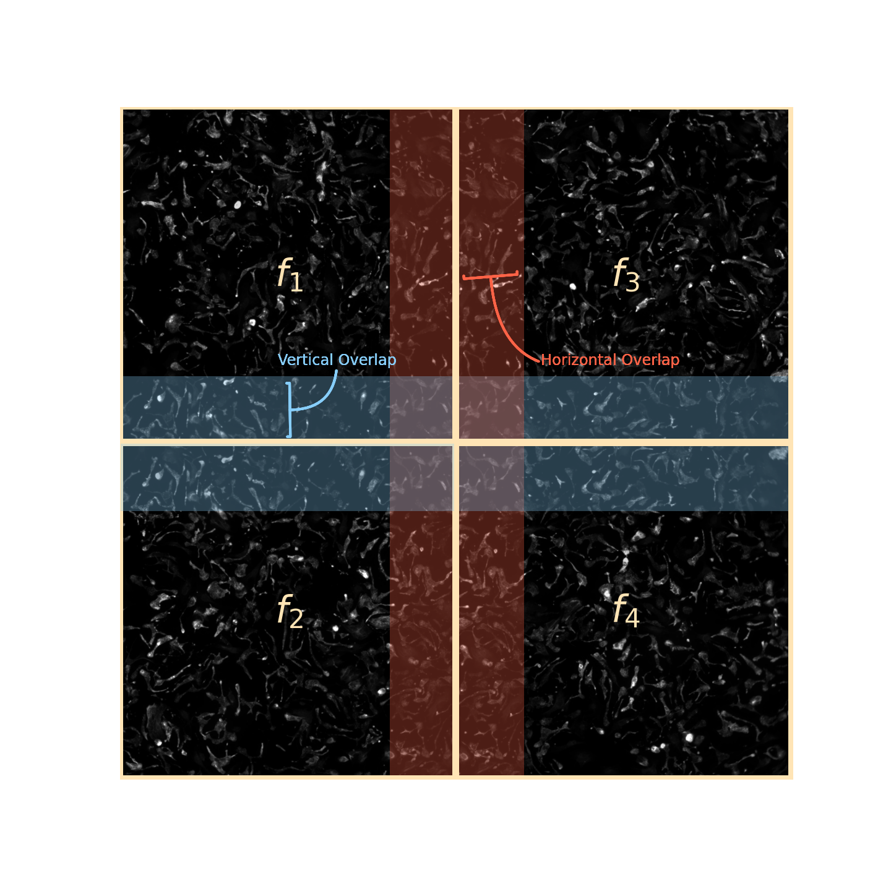

# Stitching Fluorescence Microscopy Images: FLUMI-Stitch

In automated microscopy, especially in phenotype-based high-throughput screenings, many images are acquired in a single 
run. In higher magnification the microscope's field of view (FOV) is often smaller than the specimen, although the resolution
increases. By stitching overlapping image tiles together also larger specimens or interactions can be pictured.
Thereby e.g. cells that would be otherwise cut off at the edge of the FOV or whole cellular networks become apparent.

## How it works

In this approach four steps are addressed to encounter the stitching problem:

### 1. Translation Computation

Each tile in a image grid has two to four adjacent neighbours (tiles on corners have two neighbours, tiles on edges three).
An undirected graph is created between an image and it's neighbours with translations as connections.
There are two common approaches to compute translations, feature-based and Fourier-based. In this feature-based approach
matching features between two tiles are detected by OpenCVs Scale-Invariant Feature Transform (SIFT). The Fourier-based
method uses masked normalized cross correlation of frequency components which is implemented in the scikit-image library.
Both approaches can be very effective and depend on the overall image content. It is possible to choose between the
feature-based ore Fourier-based method or to switch to the Fourier-based method only if not enough features are found.

### 2. Translation Optimization

In this step the vertical and horizontal translations are searched for outliers or connection where no translations
were found. A translation is defined as outlier if the z-score is above 3. Outliers become then replaced by the mean
value. This part also calculates the standard deviation for translations in x and y direction which allows estimations
about the mechanical stage repeatability.

### 3. Global Optimization

This part calculates final translations for each tile from the undirected graph. It created a differentiable loss by
computing the mean squared distance between true and estimated translations and uses back propagation to compute
gradients and optimizes with pytorch's Adam.

### 4. Image Composition

The final mosaic is assembled by applying the estimated translations to the image tiles. Overlay, average-blending,
linear-blending or depth-merging can be used as composition method.

**Note:** *linear-blending and depth-merging is currently under construction*

## Test methods with `demo.ipynb`

You can play with the different approaches and method in this Jupyter Notebook. Note that the code is not yet fully
tested, so please report any bugs.

## References

* [This example for aerial photos was used for the global optimization part](https://github.com/luna983/stitch-aerial-photos)
* [Scikit-Image Documentation for (masked) normalized cross correlation](https://scikit-image.org/docs/0.17.x/api/skimage.registration.html#skimage.registration.phase_cross_correlation)
* [OpenCV SIFT](https://docs.opencv.org/master/da/df5/tutorial_py_sift_intro.html)